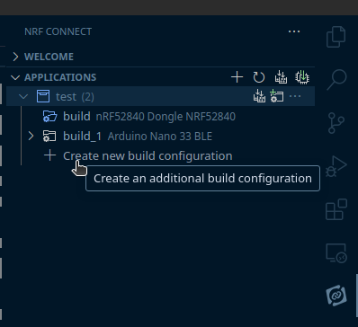
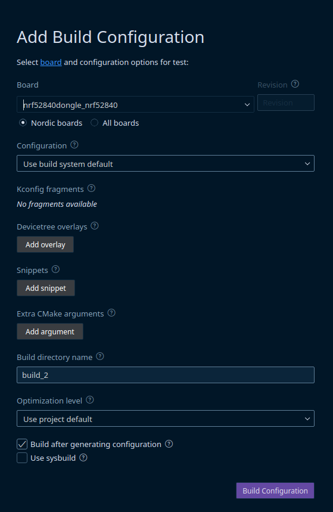
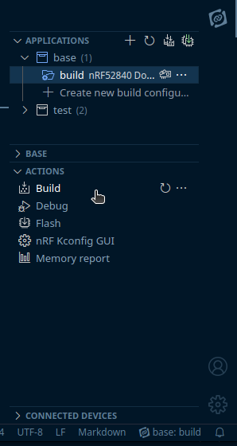

# Building the firmware

!!! note
    The project is still in development, and the steps to build and flash the firmware will change in the future.

## Building

For now zigbee_home CLI cannot build the application directly, unless run in a configured nRF Connect & Zephyr environment.

As such while this is the case - we will rely on the VS Code with nRF Connect extension to build the firmware.

### Preparing environment
Nordic provides an installation [tutorial video](https://www.youtube.com/watch?v=EAJdOqsL9m8&t=0s) for setting up the environment for VS Code.

This preparation is only needed once, and after all the tools are set up - you don't need to do it again.

### Build from extension

To build the firmware just open the generated firmware source file directory in VS Code.
Then press the nRF Connect extension in the sidebard and choose `Create new build configuration`:

This will open a new tab with some options. The only thing that needs to be changed is to provide proper board name.

Currently, **the only** supported board is `nrf52840dongle_nrf52840`. More commonly known as [nRF52840 Dongle](https://www.nordicsemi.com/Products/Development-hardware/nrf52840-dongle)

After this you can press "Build configuration" and wait for the build to finish.

!!! note
    While building there may be some warnings, but not errors. If there is an error while building the source it is most probably that there is some mis-configuration in `zigbee.yml`, or other provided configuration while generating source from CLI.

#### Building firmware again
After first build it is not necessary to create new build configuration again.

Instead open the nRF Connect extension, choose already existing configuration by clicking on it and click `Build` in `Actions` tab:

### Build with zigbee_home CLI
TBD
